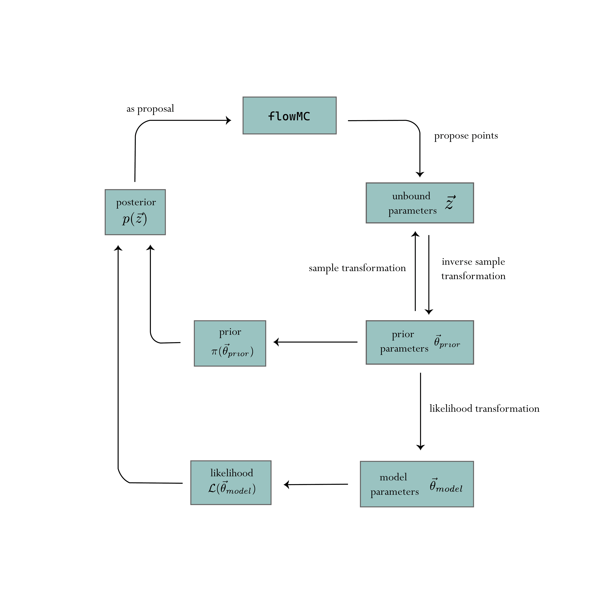

# Jim's parameter transform system

!!! warning
    **Heavy development**: This is a work in progress and is subject to change. If you have any questions, please feel free to open an issue.

The parameterization of some fundamental quantities can have significant impacts on the performance of the sampler. For example, the masses can be parameterized in the component mass spaces $\mathcal{M}_1$-$\mathcal{M}_2$ or chirp mass-mass ratio $\mathcal{M}_c$-$q$. Because of the strong correlation in the component mass space, the geometry is much harder for a sampler to explore. This can lead to slow convergence and poor performance. The chirp mass-mass ratio space is much more isotropic and easier to explore, which is often the choice to expose to the sampler.

On the other hand, defining a prior in the component mass space is much more intuitive. The common prior of choice is uniform in the component mass space with some maximum and minimum mass. One may want to define the prior in the component mass space then sample in the chirp mass space. To make the problem even worse, there is yet another set of paraemeters one may want to choose, which is the set of parameters the model may want to take. For example, the waveform generator in ripple takes the symmetric mass ratio $\eta$ as input instead of the mass ratio.

So in a general setting, there could be three sets of parametrizations we can choose for our problem: a parameterization which we want to define our prior in $\vec{\theta_{prior}}$, a parameterization which we want the sampler to see $\vec{z}$, and a parameterization which the model takes $\vec{\theta_{model}}$. To facilitate the transformation between these parameterizations, we introduce a naming system and a transform system to handle this.

A sketch of the transform system is shown below:


Fundamentally, all `jim` needs is to pass a reasonable posterior function `posterior(z) = likelihood(t_1(z)) + prior(t_2(z))` to `flowMC`, so `flowMC` can sample the function. Here, `likelihood` and `prior` are functions that one pass in a vector of numbers (and data), and it returns a scalar. `z` is the vector of variables the sampler sees, and `t_1` and `t_2` are the transforms that transform the variables between the sampler and the model. 

Since we want to sample in `z`, ultimately we want to have a prior defined in `z`, meaning we can evaluate `p_Z(z)`. However, this is could be non-trivial, such as defining a prior in the $\mathcal{M}_c$-$q$ space that is equivalent to a uniform prior in the $\mathcal{M}_1$-$\mathcal{M}_2$ space requires a very complex expression. Instead of directly writing down the prior distribution in `z`, we can start by defining the prior in a space that is more intuitive, then transform the prior to the space `z` using a transform. 

By carrying the Jacobian of the transform, we can define the prior in the space `z` by transforming the prior in the intuitive space, $p_Z(z) = p_X(x) \left| \frac{dx}{dz} \right|$, where $x = t_2(z)$. The tricky bit here is the user often wants to start from the prior $x$ and define the transform **to** the sample space `z`, but here the transform is defined **from** the sample space `z` to the prior space $x$. So in order to make the prior-to-sample transform work in practice, the transform has to be **bijective**, which implies they are invertible and have a well-defined determinant of the Jacobian.

On the other hand, the likelihood is often related to a model instead of coming from a distribution, meaning as long as one can transform the parameters to feed into the model, there is no limitation on the transform.. So the transform for the likelihood is strictly from the sample space `z` to the model space $y = t_1(z)$. For this reason, the transform for the likelihood does not need to be bijective, it can even by a N-to-M transform.

# Prior

## Setting up Priors
Prior represents the prior knowledge on the probability density distribution of the event parameters $\theta$. In Jim, we could set up priors using the prior class `jimgw.prior`. Suppose we want to define a uniform prior distribution for the parameter $x$, we could call the `UniformPrior` class:

```
from jimgw.prior import UniformPrior
prior = UniformPrior(0.0, 1.0, parameter_names=["x"])
```

Jim provides a number of built-in prior classes, including:
- `UniformPrior`
- `SinePrior`
- `CosinePrior`
- `PowerLawPrior`

A complete list of prior classes available can be found in the Jim documentation (not available yet).

### Multi-dimensional Priors
When working with multi-dimensional parameter space, we will usually want to define priors for each individual parameter first:

```
from jimgw.prior import UniformPrior
prior_x = UniformPrior(0.0, 1.0, parameter_names=["x"])
prior_y = UniformPrior(0.0, 2.0, parameter_names=["y"])
```

Once we have the individual priors defined, we can call the class `CombinePrior` to combine them into one single prior object:

```
from jimgw.prior import CombinePrior
prior = CombinePrior(
    [
        prior_x,
        prior_y,
    ]
)
```

The `CombinePrior` object takes a list of `jimgw.prior` objects as argument and combines them into one single prior object that can be fed to the Jim sampler as input.

# Transforms
In a general setting, there could be three sets of parametrizations we can choose for our problem: a parameterization which we want to define our prior in $\vec{\theta_{prior}}$, a parameterization which we want the sampler to see $\vec{z}$, and a parameterization which the model takes $\vec{\theta_{model}}$. To facilitate the transformation between these parameterizations, we introduce a naming system and a transform system to handle this. 

## Setting up Sample Transforms
As we could have two different sets of parameterization for defining the prior and for the sampler to see, we need to set up transformations which transform from the parameter set $\vec{\theta_{prior}}$ to $\vec{z}$.

### Bound-to-unbound Transforms
In general, we want the sampler to see a set of parametrization that does not includes any hard bounds, namely that it is well defined in the whole real space. This is to prevent the situation where the samples could walk out of the bound into the parameter space where it is not well defined. However, it is often the case that parametrization we used to define prior $\vec{\theta_{prior}}$ contains hard bound. Therefore, we need a bound-to-unbound transform to transform the parametrization into another parametrization $z$ without a hard bound. 

In a nutshell, bound-to-unbound transform utilize the logit function to map real numbers from $(0, 1)$ to real numbers in $(-\infty, +\infty)$. The logit function is given by:

$$
logit(\theta) = \ln{\frac{\theta}{1-\theta}}
$$

To set up bound-to-unbound transform, we use the transformation class `BoundToUnbound` provided in `jimgw.transforms`:

```
from jimgw.transforms import BoundToUnbound
sample_transform = [
    BoundToUnbound(name_mapping = [["x"], ["x_unbounded"]], original_lower_bound=0.0, original_upper_bound=1.0),
    BoundToUnbound(name_mapping = [["y"], ["y_unbounded"]], original_lower_bound=0.0, original_upper_bound=10.0),
]
```

Basically, we want to fit all the sample transformations from parametrization $\vec{\theta_{prior}}$ to $\vec{z}$ in a list, which will be passed into the `Jim` object later. When executing the transformation, the transformations will be performed in the sequence the same as how it is arranged in the list. 

### Other Sample Transforms
We can also find other transformation that is specifically made for parameter estimation of compact binary coalescence in `jimgw.single_event.transforms`. For example, if we have defined prior on component masses $m_1$ and $m_2$, but we wish to sample on chirp mass $M_c$ and mass ratio $q$ instead. We could contain the function `ComponentMassesToChirpMassMassRatioTransform` in the sample transform list:

```
from jimgw.single_event.transforms import ComponentMassesToChirpMassMassRatioTransform
sample_transforms = [
    ComponentMassesToChirpMassMassRatioTransform(name_mapping=[["m_1", "m_2"], ["M_c", "q"]]),
    BoundToUnbound(name_mapping = [["M_c"], ["M_c_unbounded"]], original_lower_bound=10.0, original_upper_bound=80.0),
    BoundToUnbound(name_mapping = [["q"], ["q_unbounded"]], original_lower_bound=0.125, original_upper_bound=1.),
]
```

Again, you should always include a `boundToUnbound` transform in the end.


## Setting up Likelihood Transform
Again, as the parameterization the model takes can be different from the parameterization for defining the prior, we need to set up likelihood transformations which transform from the parameter set $\vec{\theta_{prior}}$ to $\vec{\theta_{model}}$.

Setting up likelihood transforms is similar to setting up sample transform. We need to define a list of transformation that transform from the parameter set $\vec{\theta_{prior}}$ to $\vec{\theta_{model}}$.

```
likelihood_transforms = [
    ComponentMassesToChirpMassMassRatioTransform(name_mapping=[["m_1", "m_2"], ["M_c", "q"]]),
]
```
