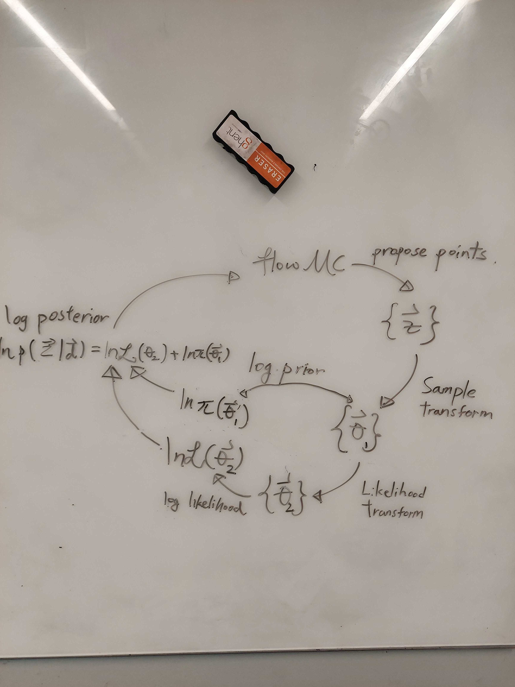

# Jim's parameter transform system

!!! warning
    **Heavy development**: This is a work in progress and is subject to change. If you have any questions, please feel free to open an issue.

The parameterization of some fundamental quantities can have significant impacts on the performance of the sampler. For example, the masses can be parameterized in the component mass spaces $\mathcal{M}_1$-$\mathcal{M}_2$ or chirp mass-mass ratio $\mathcal{M}_c$-$q$. Because of the strong correlation in the component mass space, the geometry is much harder for a sampler to explore. This can lead to slow convergence and poor performance. The chirp mass-mass ratio space is much more isotropic and easier to explore, which is often the choice to expose to the sampler.

On the other hand, defining a prior in the component mass space is much more intuitive. The common prior of choice is uniform in the component mass space with some maximum and minimum mass. One may want to define the prior in the component mass space then sample in the chirp mass space. To make the problem even worse, there is yet another set of paraemeters one may want to choose, which is the set of parameters the model may want to take. For example, the waveform generator in ripple takes the symmetric mass ratio $\eta$ as input instead of the mass ratio.

So in a general setting, there could be three sets of parametrizations we can choose for our problem: a parameterization which we want to define our prior in, a parameterization which we want the sampler to see, and a parameterization which the model takes. To facilitate the transformation between these parameterizations, we introduce a naming system and a transform system to handle this.

A sketch of the transform system is shown below:

# Prior

Fundamentally, all `jim` needs is to pass a reasonable posterior function `posterior(z) = likelihood(t_1(z)) + prior(t_2(z))` to `flowMC`, so `flowMC` can sample the function. Here, `likelihood` and `prior` are functions that one pass in a vector of numbers (and data), and it returns a scalar. `z` is the vector of variables the sampler sees, and `t_1` and `t_2` are the transforms that transform the variables between the sampler and the model. 

Since we want to sample in `z`, ultimately we want to have a prior defined in `z`, meaning we can evaluate `p_Z(z)`. However, this is could be non-trivial, such as defining a prior in the $\mathcal{M}_c$-$q$ space that is equivalent to a uniform prior in the $\mathcal{M}_1$-$\mathcal{M}_2$ space requires a very complex expression. Instead of directly writing down the prior distribution in `z`, we can start by defining the prior in a space that is more intuitive, then transform the prior to the space `z` using a transform. By carrying the Jacobian of the transform, we can define the prior in the space `z` by transforming the prior in the intuitive space, $p_Z(z) = p_X(x) \left| \frac{dx}{dz} \right|$, where $x = t_2(z)$. The tricky bit here is the user often wants to start from the prior $x$ and define the transform **to** the sample space `z`, but here the transform is defined **from** the sample space `z` to the prior space $x$. So in order to make the prior-to-sample transform work in practice, the transform has to be **bijective**, which implies they are invertible and have a well-defined determinant of the Jacobian.

On the other hand, the likelihood is often related to a model instead of coming from a distribution, meaning as long as one can transform the parameters to feed into the model, there is no limitation on the transform.. So the transform for the likelihood is strictly from the sample space `z` to the model space $y = t_1(z)$. For this reason, the transform for the likelihood does not need to be bijective, it can even by a N-to-M transform.

## Primatives

# Transforms